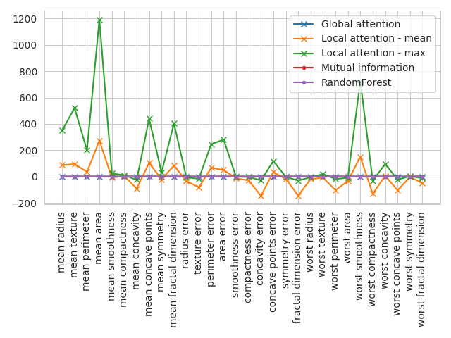
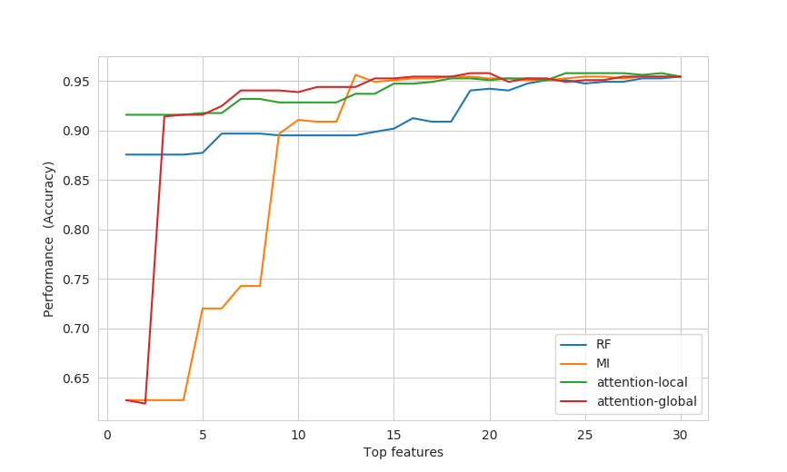

# Feature ranking with self-attention networks
This is the repository of the SAN paper, found here:

```
@misc{skrlj2020feature,
    title={Feature Importance Estimation with Self-Attention Networks},
    author={Bla\v{z} \v{S}krlj and Sa\v{s}o D\v{z}eroski and Nada Lavra\v{c} and Matej Petkovi\'{c}},
    year={2020},
    eprint={2002.04464},
    archivePrefix={arXiv},
    primaryClass={cs.LG}
}
```
Note that the full code with datasets to reproduce the paper can be found here: https://gitlab.com/skblaz/attentionrank (code is messy though, proceed with caution). The purpose of this repository is to provide all functionality in a user-friendly way. Disclaimer: this code was not extensively benchmarked and can contain bugs. If you find one, please open an issue.

# Installing SANs
```
python setup.py install
```

or

```
pip install git+https://github.com/https://github.com/SkBlaz/san
```

# Using SANs
A simple usecase is given next:


```
from scipy import sparse
import numpy as np
from sklearn.datasets import load_breast_cancer
import san
import matplotlib.pyplot as plt
import seaborn as sns
from sklearn.feature_selection import chi2,f_classif,mutual_info_classif
from sklearn.ensemble import RandomForestClassifier

sns.set_style("whitegrid")
dataobj = load_breast_cancer()
X = dataobj['data']
Y = dataobj['target']
names = dataobj['feature_names']

# let's overfit, just for demo purposes
clf = san.SAN(num_epochs = 32, num_heads = 2, batch_size = 8, dropout = 0.2, hidden_layer_size = 32)
X = sparse.csr_matrix(X)
clf.fit(X, Y)
preds = clf.predict(X)
global_attention_weights = clf.get_mean_attention_weights()
local_attention_matrix = clf.get_instance_attention(X.todense())
mutual_information = mutual_info_classif(X,Y)
rf = RandomForestClassifier().fit(X,Y).feature_importances_    

plt.plot(names, global_attention_weights, label = "Global attention", marker = "x")
plt.plot(names, np.mean(local_attention_matrix, axis = 0), label = "Local attention - mean", marker = "x")

plt.plot(names, np.max(local_attention_matrix, axis = 0), label = "Local attention - max", marker = "x")

plt.plot(names, mutual_information, label = "Mutual information", marker = ".")

plt.plot(names, rf, label = "RandomForest", marker = ".")

plt.legend(loc = 1)
plt.xticks(rotation = 90)
plt.tight_layout()
plt.show()

```




Example mock evaluation is shown below:
